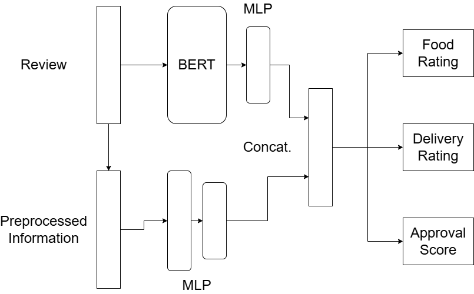

# Giacomo Carfì - Geckosoft Challenge

## Track

### Context
Imagine a food delivery company whose service is reviewed by customers. Reviews include a food rating (1-5), a delivery rating (1-5) and a textual comment of the whole order experience. Additionally, reviews are moderated and flagged as approved or rejected.

### Main assignment
1.	Design and describe a ML model that predicts the food and delivery ratings starting from the textual comment and proposes an approval or rejection with a numerical reliability estimate.
2.	How do you generate a mock dataset to train the model you designed?
3.	This service needs to be integrated into several applications (implemented in a variety of languages). How would you manage this model so that it is easy to integrate effectively into all of these applications?
4.	Implement an application (in a language of your choice except for Python) that evaluates the performance of this model on a given test dataset by invoking it as  an external HTTP API.

### Bonus tasks
1.	A frontend web-based application needs to use this service and run it client-side; how would you achieve this?
2.	Implement a job that periodically trains the model and automatically deploys it if its performance is within a given threshold.
3.	Implement and train an example model
4.	Dockerize the whole system

## Proposed Solution

### 1. Model Desing
Assuming to have a dataset containing reviews, food and delivery ratings, and approval/rejection labels, we can design a model that predicts food and delivery ratings just from the textual comment.
This is a typical NLP problem where we can use state-of-the-art transformers-like architectures models to extract information from the text and then use one or more layers of a neural network to perform the regression or classification task. 
For example, one of the most known models for this task is BERT. It is possible to use the encoder part of a pre-trained BERT model to extract embeddings from the text and then use a neural network to predict the ratings.


BERT alone may be not enough to extract relevant information. So an approach could be to use classical NLP techniques to preprocess the text and extract information like text length, number of words, number of positive/negative words, etc, and encode this information as a vector. We can use a simple neural network composed of one or more hidden layers to learn a representation of this information and fix the dimensionality of the output. 
Eventually a neural network layer can be used too on top of BERT to fix the dimensionality of the embeddings and reduce its size.
We can then concatenate the two different encodings to obtain a single vector that contains all the information needed to predict the ratings.

Since the model must perform multiple tasks, we need a multi-output neural network. In particular, we can use the combined information gathered from the previous steps and implement a neural network with three separate branches. Each branch will perform a different task: one for the food rating, one for the delivery rating, and one for the approval/rejection task.
In particular, food and delivery ratings can be seen as classification tasks since the model must predict a discrete value between 1 and 5, so we can use a softmax layer to predict the ratings, while the approval or rejection task can be seen as binary classification task, so we can use a sigmoid layer to predict the approval/rejection label.
The reliability score can be obtained from the output of the sigmoid layer which represent the confidence of the model in the approval/rejection prediction.

Picture below shows the architecture of the model:



Another possible approach is to use an external service that provides an interface to a pre-trained LLM. 
For example using prompt engineering, we can ask a LLM which are the food and delivery ratings of a review and if it should be approved or rejected.
The problems of this approach are that we need to structure the prompt in such a way that the model returns always a numerical value between 1 and 5 for both the food rating and the delivery rating, and a label for the approval/rejection.
Also, the LLM can structure the response in a way that is not easy to extract the information we need.
Finally, using external services can be very expensive.
An example of an external service is Groq https://groq.com/ which provides an API to interact with various LLMs.


### 2. Mock Dataset Generation
To generate a mock dataset we can use both publicly available datasets or generate synthetic data using generative models or APIs. 

If we were to generate reviews using LLM, we would have to structure the prompt in such a way that the model returns not only the review but also a numerical value between 1 and 5 for both the food rating and the delivery rating, and a label for the approval/rejection. 
An example of this approach can be seen in the file `food_delivery_reviews.csv` under the `data` folder, where I asked ChatGPT to generate reviews with ratings and approval/rejection labels using the prompt below.
In this case I asked ChatGPT an 'acceptance_score' as a continuous value between 0 and 1 rather than a binary label. So a threshold can be set to determine whether a review is approved or rejected.

```
I am building a food delivery review dataset so can you write a csv file containing a list of 20 reviews about a food delivery service 
The review must include information about the food experience and the delivery experience. 
The review can be positive or negative. Also, the review can be offensive or contain hate speech, my model needs to detect it. 
Please write the review in English. Please also include a food rating between 1 and 5, a delivery rating between 1 and 5 and an acceptance score as a continuous between 0 and 1 where 1 means accepted, 0 means rejected. 
Reject the reviews if they are found to be offensive or contain hate speech. 
Pay attention, some reviews may be negatives about the user experience with the restaurant but still they can be accepted since they are not offensive.
example of a row may be
Pathetic food and a stupid delivery guy. Don’t waste your money here., 1, 1, 0.01
The sushi was fresh, and the delivery person was very polite. Loved it!, 5, 5, 1

The CSV file must have as columns "review", "food_rating", "delivery_rating", "acceptance_score".
```


In case we use publicly available datasets, many websites provide reviews with ratings. We can scrape these websites and use the reviews as input data and the ratings as labels.
Some examples may be:
- https://www.kaggle.com/datasets/skamlo/food-delivery-apps-reviews/data
- https://www.kaggle.com/datasets/joebeachcapital/restaurant-reviews?resource=download

These websites provide reviews with ratings that can be used to train the model about food ratings. The main problem is that these datasets do not contain delivery ratings. To solve this problem an approach could be to fake the delivery ratings by drawing the values from a normal distribution with mean equal to the food rating and a certain standard deviation.

We need also to generate the approval/rejection labels.
A simple approach could be to use models that perform sentiment analysis from the text and mark reviews with a high positive score as ‘approved’ and reviews with a negative score as ‘rejected’.
This approach, however, could reject reviews that give a low score to the food or delivery without the review containing any form of offensive or hate speech but only because it reports the user's negative experience.

So first of all, we need to define a set of rules that determine whether a review should be approved or rejected. 
Assuming that we reject a review if it contains offensive or hate speech, we can use a model for hate speech detection and if a review contains hate speech we assign the label ‘rejected’. 
To do this we can use a pre-trained model for hate speech detection (or fine-tune it) for example models provided by Hugging Face like:
- https://huggingface.co/cardiffnlp/twitter-roberta-base-hate
- https://huggingface.co/cardiffnlp/twitter-roberta-base-offensive
- https://huggingface.co/facebook/roberta-hate-speech-dynabench-r4-target

Or python libraries like:
- profanity-check (https://pypi.org/project/profanity-check/)
- HateSonar (https://github.com/Hironsan/HateSonar)

Another reason to reject a review is if it has been created by a bot or contains unnatural patterns. Similarly, it is possible to use a pre-trained model for fake review detection, for example models like:
- https://huggingface.co/DunnBC22/bert-large-uncased-Fake_Reviews_Classifier
- https://huggingface.co/Sarwar242/autotrain-fake-reviews-labelling-37433101195

Finally, we can craft a model that combines the outputs of the previous models to predict the approval/rejection label. This model can be a simple neural network that takes as input the outputs of the previous ones and predicts the label.

### 3. Model Integration
To integrate the model into several applications, an approach is to use a REST API over HTTP protocol.
The model can be deployed on a server which exposes an HTTP endpoint.
Clients can send a POST request to the endpoint with the review text as input and receive food and delivery predictions as output in response if the review is approved or a message if the review is rejected.
Messages can be exchanged in JSON format to make the communication independent of the programming language used by the client or the server.
An example of the JSON message for a POST request may be the one below.

```json
{
  "user": "Jack Black",
  "review": "The food was delicious and the delivery was fast",
  "timestamp": "2022-01-01"
}
```

While an example of the JSON response may be the one below.

```json
{
  "food_rating": 4,
  "delivery_rating": 5,
  "approval": "approved",
  "confidence": 0.9
}
```

Or in case of rejection:

```json
{
  "approval": "rejected",
  "reason": "hate speech detected"
}
``` 

Also, the model can be deployed on a cloud platform like AWS, Google Cloud, or Microsoft Azure.

### 4. Performance Evaluation
To evaluate the performance of the model on a given test dataset, and invoke it as an external HTTP API, I decided to implement a simple web application in Javascript that uses Groq API to predict the food and delivery ratings and the approval/rejection label of a review.
This is because implementing a model like the one described on the first point requires a lot of time and resources. Much time would be spent on data collection, data preprocessing, and model training and this is not feasible in 48 hours.

The application is developed using Javascript and HTML for the frontend. It is a simple web page stored in the `index.html` file inside `templates` folder. 
It consists on a form where the user can load a test dataset in CSV format and send it to the server. 
Also, the webpage provide a threshold input where the user can set the value for the acceptance score to determine whether a review is approved or rejected.
The server will then send the reviews to the Groq API and receive the predictions in response. 
Once the predictions are received, the server will display them on the webpage along with the original reviews and ratings.
Also, a performance evaluation is done by comparing the predicted ratings with the original ones.
Accuracy metric is computed, eventually othrr mettics can per calculated like the F1 score.

The server is developed using Node.js and Express.js is used to handle file uploads, `app.js` provides the implementation of the backend.
To run the application, npm, Node.js and other dependencies must be installed.
After npm and Node.js are installed, other dependencies can be installed by running the command 

```bash
npm init -y
npm install express multer csv-parser axios dotenv
npm install --save groq-sdk
```

Before running the application, the Groq API key must be set in the `.env` file.

The application can be run by executing the command `node app.js` in the terminal and then opening the browser at the address `http://localhost:3000`.
The LLM chosen for this task is `llama-3.1-8b-instant`.

Also, the application can be run in a Docker container. To do this, Docker must be installed on the machine.
After Docker is installed, first of all, the Docker image must be built by running the command `docker build -t food-delivery-geckosoft .` in the terminal.
Then the Docker container can be run by executing the command `docker run -p 3000:3000 food-delivery-geckosoft`.


